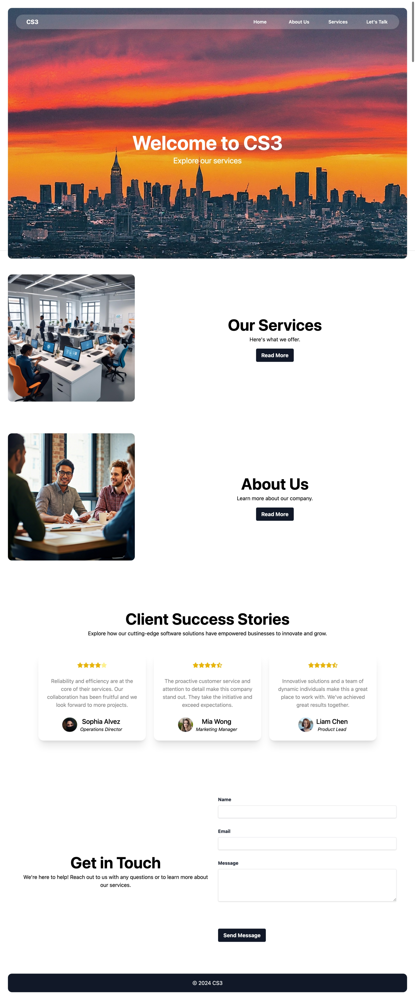
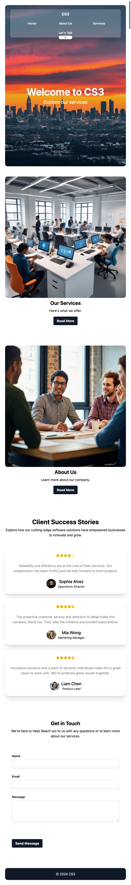
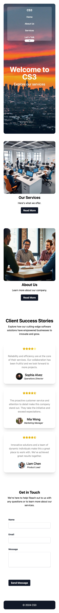

# Company Portfolio

This is a company portfolio single-page application built with React + TSX , and Framer Motion for animations. The contact form is developed using EmailJS, Yup, and Formik.

## Features

- **React & TSX: Utilized for building the user interface.
- **Framer Motion**: Used for adding smooth animations.
- **EmailJS**: Integrated for handling form submissions.
- **Yup & Formik**: Used for form validation and management.

### Contact Form

The contact form uses EmailJS to handle form submissions. You will need to set up your EmailJS account and add your user ID to the 

